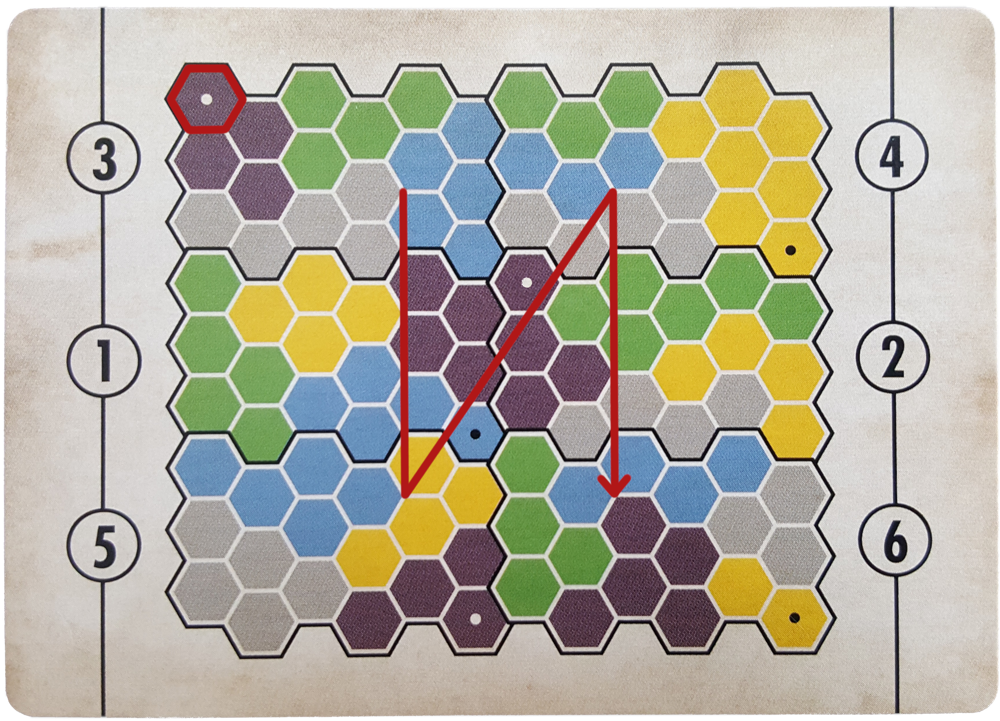
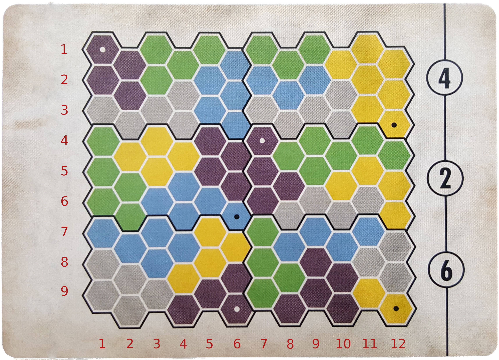

# Solving the Cryptid boardgame

A solver for the boardgame [Cryptid](https://ospreypublishing.com/store/osprey-games/board-card-games/cryptid?___store=osprey_rst). Currently this solver supports interactive mode (Helping to find good moves), but extending it to simulated games should not be too much trouble. With simulated games different gameplay styles could be analysed and compared (e.g. accounting for unknown information in decision making).

## Running the solver in interactive mode

To use the solver you will need a copy of the [Cryptid boardgame](https://ospreypublishing.com/store/osprey-games/board-card-games/cryptid?___store=osprey_rst). Installation of [Python](https://www.python.org/) is also required.

Start by installing this package.
Download the repository and run the following line in the root folder:

```
pip install .
```

Starting the interactive solver will require the following command:

```
python interactive_solver.py \
    --map ORDERED MAP DESCRIPTION. Described below \
    --structures MAP STRUCTURES. Described below \
    --players ORDERED LIST OF PLAYERS. Described below
```

### Map description

The gamemap is described in terms of the number of map piece, and it's orientation. For every map piece, the number and orientation has to be included in formar "(Number)(Orientation)". For example in the picture below, the top left map piece would be described as "3N".

The pieces must further be listed as space separated list in a column ordered fashion starting from top-left corner. See the below picture for an example.


Order of describing the map pieces. The red hexacon highlighting the orientation indicator.

The above picture would result in the following map description:
3N 1S 5S 4S 2N 6N

### Structures description

The game structures are also provided as space separated list. For every game structure the color (blue, green, or white), type (**A**bandoned **S**hack or **S**tanding **S**tone) and location is required. The following encoding is used for the game structures:

> (blue|green|white)\_(AS|SS)_(X coordinate),(Y coordinate)

Example input:

> white_AS_3,7

#### Coordinates

Are described as x,y pairs, with top-left corner being point 1,1. This coordinate system is further used to describe the placement of cubes and disks.
See the below picture for reference.


The coordinate system used throughout the solver.

### Players description

Game players are described using the player colors and using the clue look-up values provided by cryptid. To input the players, the following format must be used:

> (color)\_(Clue alphabet)(Clue number)

It's possible to include a prefix "@" for player to indicate player with a known clue. This will significantly reduce the list of possible clues.

Example input:

> @red_a2

The players will have to be listed in the order that they play the game.

## Development principles

This 'solver' is expected to require simulated games to find close to optimal strategies. Thus:

1. As the number of required simulations can become numerous, following choices are attempted to encourage.
    1. Mutable states are avoided - to allow easy parallel branching
    2. Use set operations - inexpensive and fitting for the gameplay
2. Attempt to use class structures that easy to grasp
3. Attempt to use polymorphism, and small set of functions. Following ['Simple Made Easy'](https://www.infoq.com/presentations/Simple-Made-Easy) talk

## Milestones

* 17.5.2021: Solver's first win against a human 🥳
